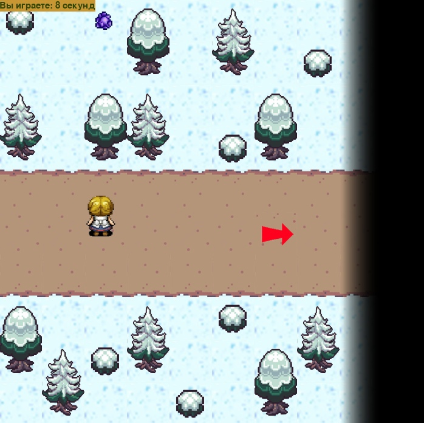
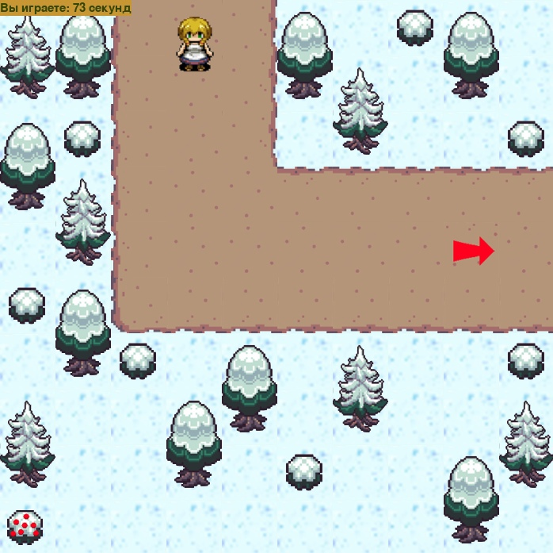

# Journey In The Dream
### Выполнили: Фурсова Ксения, Энгель Василиса

Путешествие во сне — игра в жанре RPG, в которой главная героиня попадает в мир своих снов. Чтобы не остаться здесь навсегда, ей нужно как можно скорее вернуться в реальность! Помогите ей преодолеть опасности, встречающиеся на её пути...

Для прохождения игры нужно продвигаться по сюжету, решая пятнашки, выдоваемые разными персонажами.
С продвижением дальше по сюжету будет расти сложность пятнашек (увеличится число сегментов).

### Правила и особенности геймплея
- Чтобы пройти дальше, нужно найти особый предмет
- При получении предмета запускается мини-игра Пятнашки
- Мини-игра после выигрыша или через три минуты после старта пятнашек
- Чтобы убрать фразу на экране, надо нажать пробел

### Основные классы
- Hero – главный герой
- Level – уровень
- Game – осуществление взаимодействий Hero и Level 
- Objects – объекты для взаимодействия
- Minigame - пятнашки

### Техническое задание:

- Сохранение времени прохождения в файле
- **5+ окон:**
  - Начальное окно (окно входа в игру)
  - Финальное окно с результатами
  - 4 сюжетных окна
- Фоновая музыка
- Таймер (подсчет общего времени прохождения, ограничение времени в пятнашках)

### Управление:
- стрелки для передвижения
- левая кнопка мыши для игры в пятнашки

### Визуальное оформление:
Фоновое изображение, спрайты персонажей и предметов будут отрисованы вручную. При ходьбе будут анимации.
Персонаж не будет проходить сквозь другие объекты на экране

### Перспективы развития
- Вставить больше анимаций
- Добавить музыку при взаимодействиях
- Прописать диалоги
- Улучшить систему перешмещения

### Скриншоты из игры:

